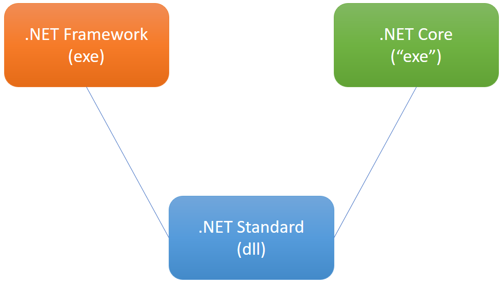

# .NET Performance Comparison

This is a simple solution that proves the performance imrpvements of .NET Core 2.0 over .NET Framework 4.7.  
It's based on the blog post [Performance Improvements in .NET Core](https://blogs.msdn.microsoft.com/dotnet/2017/06/07/performance-improvements-in-net-core/) it was shown as part of my presentation on the fourth edition (2017) of the [NetConfUY](http://netconf.uy) called ".NET Core for everyone".

The VS2017 solution (dotNet Performance.sln) has three projects:
- StandardLibrary is a .NET Standard 2.0 library
- ConsoleFramework is a .NET Framework 4.7 console application with a reference to the StandardLibrary project
- ConsoleCore is a .NET Core 2.0 console application also with a reference to the StandardLibrary project

Every function that tests a feature is in the StandardLibrary, so the code for both projects is exactly the same. Even the code of every console application is a shared source file.

It works thanks to the fact that both .NET Framework 4.7 and .NET Core 2.0 are .NET Standard 2.0 compatible. [More info here](https://docs.microsoft.com/en-us/dotnet/standard/net-standard)
